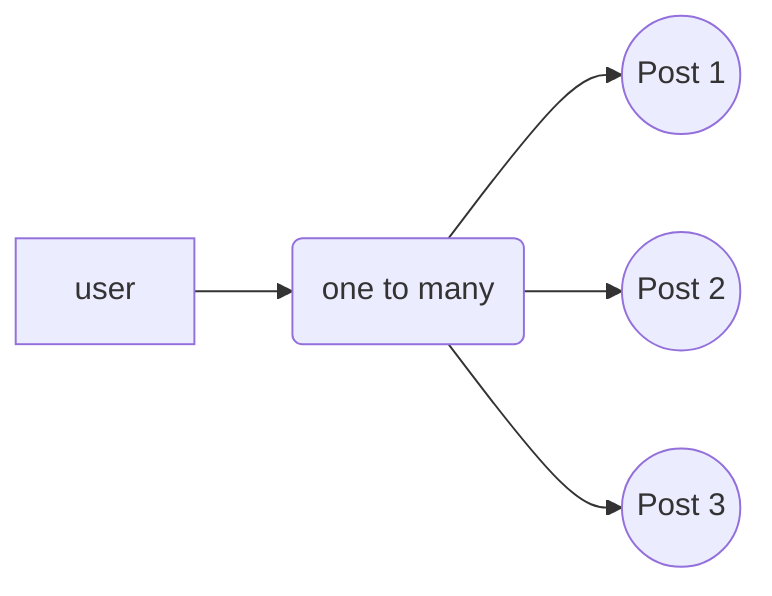
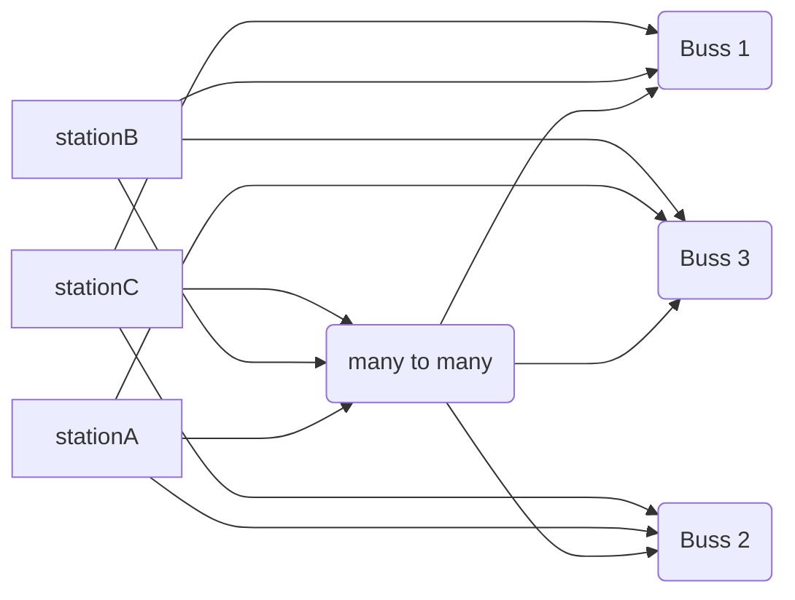

## MSquare Programing Fullstack Course
### Episode-*65* 
### Summary For `Room(2)`
### Introducing Database
- database မှာ အဓိကအားဖြင့် SQL database နဲ့ No SQL database ဆိုပြီး နှစ်မျိုးရှိပါတယ် 


- ဒီနေ့ သင်ခန်းစာမှာတော့ SQL db(DataBase) အကြောင်း လေ့လာသွားကြပါမယ်
- Sql database ကို အသုံးပြုဖို့ အတွက် sql language နဲ့ ရေးသားပေးရပါတယ်
- sql command တစ်ခု ပြီးတိုင်း **`;`** နဲ့ ပိတ်ပေးရပါမယ်
##
### Connecting tables in sql database
- SQL database တွေဟာ relational database အမျိုးအစားတွေ ဖြစ်ကြပါတယ်
-  SQL database ထဲရှိ table တွေဟာ တစ်ခုနဲ့ တစ်ခု ချိတ်ဆက်ပြီး အသုံးပြုလို့ ရပါတယ်
### why relation?
- SQL မှာ dataတွေကို table နဲ့ သိမ်းလေ့ရှိပါတယ်
- တကယ်လို့ data တွေကို table တစ်ခုထဲ စုပြီး သိမ်းထားမယ်ဆိုရင် 
  - data တွေ ထပ်လာမျိုး ရှိလာပါမယ် ( data duplicate)
  - အဲ့ဒီ table ထဲက data တစ်ခုခုရှာမယ်ဆို သိမ်းထားတာ တွေ များနေတာမလို့ အချိန်ကြာပါမယ်။
  - မလိုအပ်ပဲ resource တွေ အများကြီး သုံးရပါမယ်
- ဒါကြောင့်မလို့ SQL မှာ table တွေ အများကြီး လုပ်ပြီး တစ်ခုနဲ့ တစ်ခု ချိတ်ဆက်ပြီး သုံးလေ့ရှိပါတယ်။

##
### *primary key*(PK) and *foreign key*(FK) 
- table တစ်ခု ကို နောက် table တစ်ခုနဲ့ ချိတ်ဆက်သုံးတဲ့ အခါ *foreign key* အနေနဲ့ ချိတ်ဆက်ပေးလေ့ရှိပါတယ်။
### နမူနာ

- parent table ကို child table နဲ့ ချိတ်ဆက်လိုတဲ့အခါ parent ရဲ့  id ( PK ) ကို child table ထဲမှာ ( FK ) အနေနဲ့ column တစ်ခု ထည့်ပြီး ချိတ်ဆက်ပေးရပါမယ်။

##
### Relationship in SQL
- SQL dbမှာ table တွေ ချိတ်ဆက်တဲ့ အခါ  အများအားဖြင့် relation သုံးမျိုးဖြင့် ချိတ်ဆက် အသုံးပြုကြပါတယ်
### one to one relation 
### one to many relation
### many to many relation
##
### one to one relation 
- data တစ်ခု ကနေ  တစ်ခု ဆီကိုပဲ ချိတ်ဆက်တာကို ဆိုလိုတာပါ။
- ဥပမာ ။   ။
   
   - country နဲ့ capital table နှစ်ခုရှိတယ်ဆိုပါစို့
   - အဲ့ဒီနိုင်ငံ အတွက် မြို့တော်ဟာ တစ်မြို့ပဲ ရှိတာမလို့ country id ( PK ) ကို capital မှာ FK အဖြစ် တစ်ခုပဲ ချိတ်ဆက်ထားရမှာကို ဆိုလိုတာပါ
   ##
   ### one to many relation
   - တစ်ခုကနေ အများကို ချိတ်ဆက်ပေးတာဖြစ်ပါတယ်။
   - ZOOM meeting တစ်ခုကို user အများ join ထားသလိုမျိုးပါ။
   - နောက် ဥပမာ တစ်ခုက Facebook မှာ user တစ်ယောက်က status post အများကြီး တင်ထားသလိုမျိုးပါ။
  

##
### many to many relation
- အများနဲ့ အများ ကိုချိတ်ဆက်တာဖြစ်ပါတယ်

- station A က bus 1 ,2,3 နဲ့ ချိတ်ဆက်ထားသလို
- bus 1 ကလည်း station A,B,C ကို ချိတ်ဆက်ထားပါတယ်
- ကျန်တဲ့ station တွေကလည်း bus အားလုံးနဲ့ ချိတ်ဆက်ထားသလို
- bus အားလုံးကလည်း station အားလုံးနဲ့ ချိတ်ဆက်ထားတာမလို့၏
- many to many relationship ဖြစ်ပါတယ်။
##
## Useful sql command
|        command        |         Usage              | meaing                       |
|----------------|-------------------------------|-----------------------------|
|`\l`|`\l`|List all database            |
|`CREATE DATABASE`|`CREATE DATABASE your_db_name;`|Create new database           |
|`\q`|`\q`|Qiut from current          |
|`\c`|`\c`|show current database            |
|`\c`|`\c your_db_name`|switch and connect to your db           |
|`\dt`|`\dt`|show table details in current db            |
|`\d+`|`\d+ table-name`|show table columns details             |
|`CREATE TABLE`|`CREATE TABLE IF NOT EXISTS table_name(table items);`|create table            |
|`DROP DATABASE`|`DROP DATABASE db_name;`|delete database            |
|`INSERT INTO `|`INSERT INTO table_name (items name) VALUES (values);`|Insert row into table           |
|`SELECT `|`SELECT * FROM table-name;`|select all from table         |
|`WHERE`|`WHERE gender = 'male';`|use to ckeck a specified condition.            |
|`AND` `OR` `NOT`|`WHERE gender = 'male' AND age ='20';`|use to ckeck more than one condition.            |
##

### https://www.sqlteaching.com/ မှာ sql ကို နဲနဲ စမ်းရေးကြည့်ပါမယ်။
- ပထမ သင်ခန်းစာမှာတော့ table ထဲက အကုန်လုံးကို select လုပ်ခိုင်းတာမလို့ 
`SELECT * FROM family_members;`
ဆိုပြီး ရေးထည့်ပေးလိုက်ပါတယ်။


- sql command box ထဲမှာ `SELECT * FROM family_members;` ရေးထည့်ပြီး Run SQL လုပ်လိုက်တဲ့အခါ  Congrats....ဆိုပြီး next lesson ပြလာရင် အဖြေ မှန်တာဖြစ်ပါတယ်။
- next lesson ကို နှိပ်ပြီး လုပ်ခိုင်းတာတွေ ဆက်လုပ်ကြည့်ပါမယ်
https://www.sqlteaching.com/#!select_columns
- Can you return just the name and species columns?
- name နဲ့ species column က data တွေပဲ return လုပ်ခိုင်းတာမလို့
```sql
SELECT name,species  FROM family_members
```
- ထည့်ပေးလိုက်ရင် အဆင်ပြေသွားမှာဖြစ်ပါတယ်
- family_members table ထဲက nname နဲ့ species column အောက်က data တွေပဲ  Select လုပ်လိုက်တာဖြစ်ပါတယ်။
##
 lesson -3 https://www.sqlteaching.com/#!where_equals
 - Can you run a query that returns all of the rows that refer to dogs?
 ```sql
SELECT * FROM family_members WHERE species = 'dog';
```
##
lesson-4 https://www.sqlteaching.com/#!where_greater_than
- Can you run return all rows of family members whose num_books_read is greater than 190?
```sql
SELECT * FROM family_members WHERE num_books_read >190;
```
##
lesson -5 https://www.sqlteaching.com/#!where_greater_than_or_equal
- Can you return all rows in **family_members** where num_books_read is a value greater or equal to 180?
```sql
SELECT * FROM family_members WHERE num_books_read >= 180;
```
##
## Postgresql database
 ***Postgresql*** database အကြောင်း လေ့လာသွားပါမယ်
- Postgresql ကို Postgres ( ပို့စ်ဂရက်စ်) လို့လဲ ခေါ်ကြပါတယ်။
- SQL database အမျိုးအစားဖြစ်ပြီး data တွေကို table နဲ့ သိမ်းပေးရမှာ ဖြစ်ပါတယ်။
- Postgres ထဲက data တွေကို SQL language နဲ့ ချိတ်ဆက်အသုံးပြုရမှာဖြစ်ပါတယ်။
##
### Postgres ကို အသုံးပြုနိုင်ရန် မိမိ စက်ထဲမှာ install လုပ်ပေးရပါမယ်
https://www.postgresql.org/download/ မှာ postgres ကို download ရယူနိုင်ပါတယ်
- ရလာတဲ့ postgres ကို install လုပ်ပေးလိုက်ပါက အောက်ကပုံလို ရလာမှာဖြစ်ပါတယ်။


- postgres ကို setup လုပ်ဖို့ windows key ကို နှိပ်ပြီး psql လို့ ရှာလိုက်ပြီး ဖွင့်လိုက်ပါ။
Server [localhost]:
Database [postgres]:
Port [5432]:
Username [postgres]:
- တွေကို enter သာ ခေါက်ပေးလိုက်ပါ။
- password မေးလာတဲ့အခါ install လုပ်တုန်းက ထည့်ခဲ့တဲ့ password ကို ရေးထည့်ပြီး enter ခေါက်ပေးလိုက်ပါ
- password ကို ထည့်တဲ့အခါ terminal မှာ ဘာမှပြပေးမှာ မဟုတ်ပါဘူး။ မှန်အောင်သာရေးပြီး enter ခေါက်လိုက်ပါ။
- အောက်ကပုံလို ပေါ်လာရင် postgres database ထဲ  ရောက်ပါပြီး။


###
## Create new database in postgres
- psql ထဲမှာ postgres အထဲ အရင် ၀င်လိုက်ပါ
```sql
postgres=# CREATE DATABASE happy_pos2_db;
```
- CREATE DATABASE ကို သုံးပြီး happy_pos2_db ဆိုတဲ့ database တစ်ခု တည်ဆောက်လိုက်ပါတယ်
- CREATE DATABASE လို့ အောက်မှာ ပြပေးလာရင် db တစ်ခု လုပ်လို့ပြီးပါပြီး
- `\l` ကို သုံးပြီး list လုပ်ကြည့်လို့ရပါတယ်။
```sql
postgres=# \l
                                                                      List of databases
         Name         |  Owner   | Encoding |          Collate           |           Ctype            | ICU Locale | Locale Provider |   Access privileges
----------------------+----------+----------+----------------------------+----------------------------+------------+-----------------+-----------------------
 happy_pos2_db        | postgres | UTF8     | English_United States.1252 | English_United States.1252 |            | libc            |


 postgres             | postgres | UTF8     | English_United States.1252 | English_United States.1252 |            | libc            |
 template0            | postgres | UTF8     | English_United States.1252 | English_United States.1252 |            | libc            | =c/postgres          +
                      |          |          |                            |                            |            |                 | postgres=CTc/postgres
 template1            | postgres | UTF8     | English_United States.1252 | English_United States.1252 |            | libc            | =c/postgres          +
                      |          |          |                            |                            |            |                 | postgres=CTc/postgres
```
- ဆက်ပြီး ခုနက အသစ်လုပ်လိုက်တဲ့ happy_pos2_db  ထဲ၀င်ပြီး table တစ်ခု create လုပ်ကြည့်ပါမယ်။
- `\c happy_pos2_db`
```sql
postgres=# \c happy_pos2_db
You are now connected to database "happy_pos2_db" as user "postgres".
```
- user ဆိုတဲ့ table တစ်ခု create လုပ်ကြည့်ပါမယ်
 `CREATE TABLE table-name ( column-name1 type spec,column-name2 type spec) ` အဲ့လိုပုံစံနဲ့ ထည့်ချင်တဲ့ column တွေကို  **`( .. )`**  ထဲ ထည့်ပေးရမှာဖြစ်ပါတယ်
```sql
happy_pos2_db=# CREATE TABLE users (id serial primary key,name text not null,eamil text not null);
```
- users ဆိုတဲ့ table တစ်ခု create လုပ်လိုက်ပြီး အဲ့ဒီ table ထဲမှာ id , name , email အစရှိတဲ့ column တွေ ပါမယ်လို့ ထည့်ရေးထားတာဖြစ်ပါတယ်။
- ခု လုပ်လိုက်တဲ့ table ကို ပြန်ကြည့်ဖို့ **`\d+`** ကို အသုံးပြုပါမယ်။
```sql
happy_pos2_db=# \d+ users
                                                       Table "public.users"
 Column |  Type   | Collation | Nullable |              Default              | Storage  | Compression | Stats target | Description
--------+---------+-----------+----------+-----------------------------------+----------+-------------+--------------+-------------
 id     | integer |           | not null | nextval('users_id_seq'::regclass) | plain    |             |              |
 name   | text    |           | not null |                                   | extended |             |              |
 eamil  | text    |           | not null |                                   | extended |             |              |
Indexes:
    "users_pkey" PRIMARY KEY, btree (id)
Access method: heap
```
- အဲ့တာဆိုရင် table ကို create လုပ်ပြီး ပြန်စစ်ကြည့်လို့ အဆင်ပြေပါပြီး
##
### Using postgres with GUI tool ( PgAdmin 4)
- postgres ကို psql shell (termianl) ကနေသုံးလို့ရသလို GUI tool တစ်ခုဖြစ်တဲ့ pgAdmin ကနေလည်း အသုံးပြုလို့ရပါတယ်။
- pgAdmin ကို ဖွင့်ပြီး
```sql
- server >
-- PostgreSQL 15 >
  --- Database >
   ---- happy_pos2_db >
    ----- Schemas >
     ------ table 
   
 

```
- အဆင့်ဆင့် ၀င်လိုက်လို့ရှိရင် ခနက create လုပ်ထားတဲ့ users table ကို မြင်ရမှာဖြစ်ပါတယ်။
- users table ကို R-click နှိပ်ပြီး view/edit data > all rows ကနေ ၀င်ကြည့်လို့ရပါတယ်။

